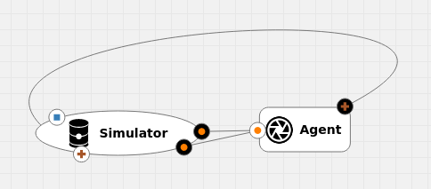

## Overview

This is repository contains an implementation of [this](https://fenix.tecnico.ulisboa.pt/cursos/meic-t/dissertacao/846778572212554) thesis directed to the AI4EU
platform.


It's comprised of two docker images. One containing the environment using the
Sumo simulator. The other one contains an RL agent acting on the environment.
Aditionally an orchestrator was implemented to mimic the Acumos pipeline
behaviour. 

Generally in a gRPC service, the servicer send the response to the caller. Here,
Acumos platform allows to reroute these calls/response to different services,
creating a pipeline or a chain. This can then be deployed onto a Kubernetes
cluster.

### Orchestrator

An orchestrator is used to simulate the gRPC call re-routings made by the Acumos
platform.

<p align="center">
  
</p>

### Simulator

The simulator is a wrapper of the Sumo simulator, that provides more
functionality. The simulator is directly targeted to Trondheim city, with the
goal to study the traffic related emissions. It is possible to replace the used
map. It is recommended to use OSMWebWizard to create the map. After that you
need to generate the traffic, you can do it manually or use a tool like
dfrouter.

The simulator was then converted to a gRPC service. The currently implemented
methods provide the basic information about the traffic and emissions. Two
agents are provided as example to act on the environment. It is not mandatory to
use any agent to act on the simulator. You can simply create a data sink to
gather information from the simulator.

Currently, you need to implement calls for these methods:


```protobuf
syntax = "proto3";

package simulation;

message InitRequest {
    string StartDate      = 1 ;
    string EndDate        = 2 ;
    float DensityPerc     = 3 ;
}

message StepRequest {
  int32 numSteps = 1;
  map<string, bool> cell_state = 2;
}

message Position {
    int32 x = 1;
    int32 y = 2;
}

message StateResponse {
  int32 currentStep = 1;
  map<string, float> emissions = 2;
  map<string, int32> vehicles = 3;
  map<string, int32> state = 4;
  map<string, Position> cell_map = 5;
  bool hasEnded = 6;
}

//Define the service
service Simulator{
  rpc start_simulation(InitRequest) returns (StateResponse);
  rpc step(StepRequest) returns (StateResponse);
}
```

## Adding new agent

The `rl-agent` is already structured to easily add new agents. `agent_server.py`
takes care of receiving the communication from the simulator and piping it to
`agent_actor.py`. `agent_actor.py` is where the agent is implemented. 

To start, you can use the `agent_actor_template.py` to implement your agent.
This file contains a template class for the agent. The agent implementation is
up to you. The only thing that you need to do is make sure that the function
`get_action` returns a dictonary which contains the binary state of each cell, as shown below:

```python
{
  "poly_01": 1,
  "poly_02": 1,
  "poly_03": 0,
  "poly_04": 1,
  ...
}
```

After implementing your agent, replace the existing `agent_actor.py` by your new
agent and modify the existing `Dockerfile` with the instructions on how to build the
docker image.

## Training an agent

The full version of the simulator can be found [here](https://fenix.tecnico.ulisboa.pt/cursos/meic-t/dissertacao/846778572212554). In the `./examples/rl/` you'll find an example on how to train an
RL Agent. The current implementation uses RLlib framework to train the agent.
The simulator is modeled as a Gym Environment in the `custom_env.py`. It's there
where you specify the observation and the reward function. In the `train.py` is
where agent's training lies. If you want to train a new agent, you'll have to
modify these two files. To start the training, run the `run.py` script. After the training, you'll have to copy the latest checkpoint and
replace the `model` folder in the `rl-agent`.

If you want to use a different framework that is not RLlib, you only need to
modify the `train.py`. 
If you're running the Sumo simulator with libsumo, you
won't be able to use the Stable Baseline implementations.

### Extending the simulator

You can easily add new service calls to the simulator by modifiying the `simulator.proto` and implementing the simulator servicer. After this, you should also add the reverse version of the call to the agents.

Example of a call implementation:
```protobuf
//Define the service
service Simulator{
  rpc step(StepRequest) returns (StateResponse);
}
```

```protobuf
//Define the service
service Agent {
  rpc get_action(StateResponse) returns(StepRequest);
}
```
## Building

After changing any protobuf file, run these commands to populate the correct
directories and build the stubs:
```console
./populate-duplicate-protobufs.sh
./rebuild-all-protobufs.sh
```

To build the docker images, you can go to each directory, `rl-agent`,
`reactive-agent`, `simulator`, and run this command:

```console
./{folder}/docker-build.sh
```

Alternatively you can run the helper script that will trigger the build for all
the images:

```console
./docker-build.sh
```

## Running

To run the project locally, first you need to run the docker images and then the
orchestrator. Alternatevily you can upload the images to the Acumos platform and
deploy it to a Kubernetes cluster. 

### Docker images

There are two modes that you can run the images, in interactive or detached.
Interactive will block the terminal and print out what is happening in the
image. Detached is non-blocking and runs in the background.

To run the images, you can go to each directory, `rl-agent`,
`reactive-agent`, `simulator`, and run one of these commands:

* For interactive:
```console
./{folder}/docker-run-interactive.sh
```

* For detached:
```console
./{folder}/docker-run-detached.sh
```

Alternatevily, you can run all the images simultaneously. You'll have to change
the script if you want to change the agent that is being run.
```console
./docker-run-all-detached.sh
```

To kill all detached images, you can run:
```console
./docker-kill-all.sh
```
**_Note:_** Make sure not to run two agents simultaneously.

### Orchestrator

Orchestrator aims to emulate the Acumos connections. It has hardcoded
connections for the agent and the simulator. 

First run the agent and the simulator, and then you can start the orchestrator
by running:

```console
python ./orchestrator/orchestrator.py 
```
